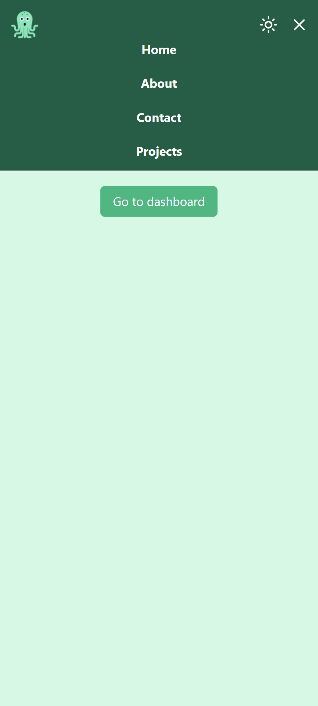
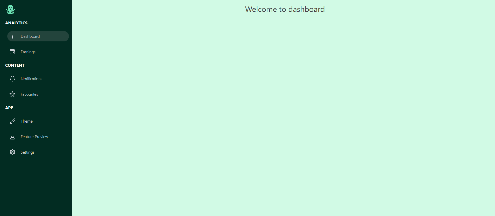

# Kraken Kit

This repo contains some custom responsive components or you could say a sample site I created in React(Vite) with tailwindcss. As to why I named it kraken kit? just for fun...

## Components

The current good components this repo has:
 - Header including: Logo and Navbar
   
 
 
 
 
 

 - Sidebar with options

 
 
 
 
 
